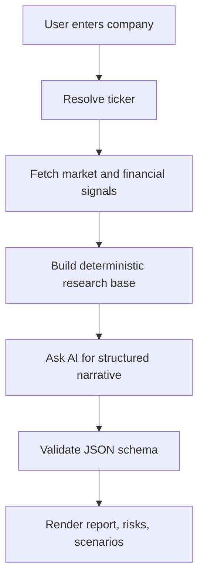

# Vigilant Equity Research Agent

Vigilant is an AI-assisted Indian equity research workspace that turns a stock name into a structured, evidence-backed investment view. It is built to answer the question I kept running into while researching public companies: "What would make this stock worth watching, and what would prove me wrong?"

Live app: [equity-research-agent.rajatendud.chatgpt.site](https://equity-research-agent.rajatendud.chatgpt.site)

## What It Does

- Searches Indian listed companies by name or ticker, including aliases such as Asian Paints, Berger Paints, Nerolac, Reliance, TCS, Infosys, and Cupid.
- Builds a buy/watch/avoid-style research view from company fundamentals, price action, valuation signals, risks, and available third-party consensus.
- Separates the output into positives, risks, assumptions, invalidation checks, next checks, valuation read, governance read, financial read, and missing data.
- Uses deterministic fallback logic when AI analysis is unavailable so the app still returns a usable report instead of failing silently.
- Includes a decision journal style interface for scenarios, risk controls, scorecards, performance context, quarterly tracking, and research snapshots.
- Presents the output in a polished liquid-glass UI with responsive layouts for desktop and mobile.

## Why I Built This

Most stock research tools either give raw data without a thesis, or a confident recommendation without enough reasoning. Vigilant sits in the middle: it gives a structured view, but keeps the assumptions visible. The goal is not to replace judgment; it is to make judgment harder to fake.

I built it as a full-stack product experiment around AI judgment, financial data workflows, and fast product iteration. It combines my backend/data engineering background with a product surface that is easier for a normal investor to use.

## Product Flow



## Tech Stack

| Layer | What It Uses |
| --- | --- |
| Frontend | Next.js, React, TypeScript, custom CSS |
| Runtime | Vinext on OpenAI Sites / Cloudflare-style worker runtime |
| API | Next server routes under `app/api` |
| AI | NVIDIA-hosted model integration with strict structured-output validation |
| Data | Screener company lookup, Yahoo Finance-style consensus/market endpoints, deterministic local analysis |
| Storage | Drizzle/D1-ready schema and migrations |
| Testing | Node test runner, build validation, structured-output parser tests |

## Architecture

The main analysis endpoint is `app/api/analyze/route.ts`. It performs ticker resolution, market-data collection, deterministic analysis, optional AI enrichment, schema validation, and fallback report generation.

The AI response is intentionally constrained by `app/api/analyze/structured-output.ts`. This avoids a common failure mode in AI products: the model writes something that looks plausible but breaks the UI or quietly omits important fields.

## Key Features

- **Structured verdicts:** `Potentially investable`, `Wait / watchlist`, `Avoid`, or `Insufficient evidence`.
- **Scenario lens:** cautious, base, and upside framing instead of a single overconfident target.
- **Risk-first interface:** risks, invalidation triggers, and missing data are kept visible.
- **Third-party comparison:** checks available analyst consensus and shows divergence when usable.
- **Fallback analysis:** deterministic report generation keeps the product useful during provider/API failures.
- **Roadmap-ready product surface:** research timeline, snapshots, quarterly tracker, scorecard, and decision-journal concepts are built into the UI direction.

## Local Setup

Prerequisites:

- Node.js `>=22.13.0`
- Linux shell environment with `bash`, `curl`, `flock`, and GNU `timeout`

Install dependencies:

```bash
npm run install:ci
```

Run locally:

```bash
npm run dev
```

Build and validate:

```bash
npm run build
```

Run tests:

```bash
npm test
```

## Environment Variables

The app can run deterministic analysis without AI, but AI narrative generation expects:

```bash
NVIDIA_API_KEY=your_key_here
```

Do not commit real API keys. The repository only references environment variables.

## Important Files

| Path | Purpose |
| --- | --- |
| `app/page.tsx` | Main product UI |
| `app/api/analyze/route.ts` | Core research API and analysis orchestration |
| `app/api/analyze/structured-output.ts` | AI JSON schema and parser |
| `app/api/quote/route.ts` | Quote/data route |
| `app/api/research/route.ts` | Saved research route |
| `app/api/snapshots/route.ts` | Snapshot route |
| `db/schema.ts` | Drizzle/D1 schema |
| `tests/nvidia-structured-output.test.ts` | AI schema/parser tests |
| `tests/rendered-html.test.mjs` | Rendered metadata/build sanity test |

## Validation Status

Current validation:

```bash
npm test
```

Result:

- Production build completed successfully.
- Sites artifact validation passed.
- 5 tests passed.
- 0 tests failed.

## Latest Product Iteration

- Stabilized Watchtower evidence review by replacing DOM-level click handlers with React state.
- Fresh evidence refreshes now save dated snapshots, making repeated scans comparable over time.
- Added a clear Evidence diff action beside Review so thesis review and source-change review are separate user flows.
- Preserved fresh-clone build reliability by ensuring project shell scripts are executable.
- Added the first Portfolio command centre pass inside Watchtower with owned-idea return read, review burden, and concentration prompts.

## Roadmap

- Add richer primary-source evidence from annual reports, exchange filings, and earnings calls.
- Add a research timeline with dated thesis changes.
- Add user-owned watchlists and decision journals.
- Improve peer comparison and sector-level views.
- Add confidence-stability tracking across repeated runs.
- Expand coverage for small-cap and less frequently covered Indian stocks.

## Disclaimer

Vigilant is a research and decision-support tool, not financial advice. It can help structure a thesis, surface risks, and organize evidence, but investment decisions still require independent verification.
